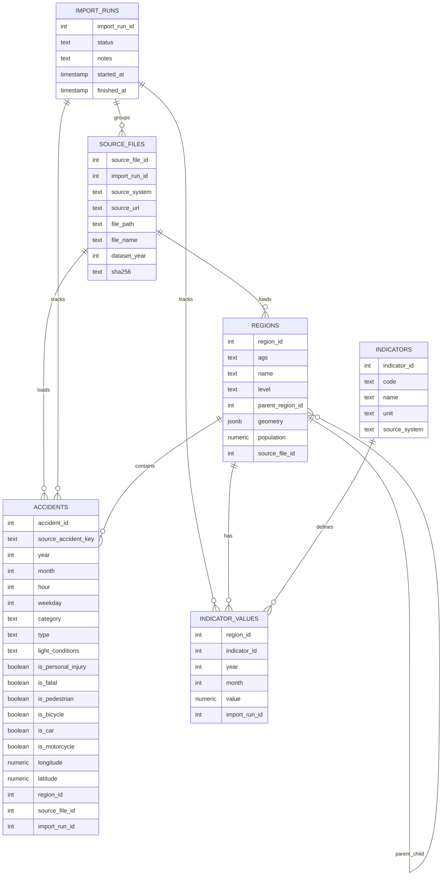

# Backend Overview

This backend is designed to answer traffic-accident questions only from the normalized database.
No answer is hardcoded.

## Reproducibility

- Raw downloads are saved in `data/downloads`
- File checksums are stored in `source_files`
- Every ETL run is stored in `import_runs`
- Source references are stored for each downloaded file

## Current Source Strategy

- Unfallatlas: discovered from the official source index and downloaded as yearly raw files
- GV-ISys: newest official `*_Auszug_GV.xlsx` file is discovered from Destatis, with a pinned fallback if discovery fails
- Regionalatlas: official table codes are fixed because they define the indicators; table downloads provide the values

This is reproducible because the same source URLs, checksums, and import runs can be reused.
It is dynamic where the source offers discoverable files, and controlled where official table codes define the required indicator.

## ETL Flow

1. Extract
2. Parse
3. Transform
4. Load
5. Aggregate
6. Save provenance

## Canonical Schema

## Source To Table Mapping

### GV-ISys -> `regions`

Normalized fields:

- `land` -> state AGS prefix
- `rb` + `kreis` -> district AGS
- `rb` + `kreis` + `gem` -> municipality AGS
- `name` -> region name
- `satzart` -> region level
- `longitude` / `latitude` -> geometry
- `populationTotal` -> population

### Unfallatlas -> `accidents`

Normalized fields:

- year, month, hour, weekday
- category and accident type
- light conditions
- personal injury / fatal / pedestrian / bicycle / car / motorcycle flags
- longitude / latitude
- resolved `region_id`

### Regionalatlas -> `indicators` and `indicator_values`

Normalized fields:

- regional accident totals
- population
- area
- vehicle stock
- passenger cars

## What Answers Which Question

- Earliest accident year -> `accidents`
- Personal injury accidents in a state/year -> `accidents` + `regions`
- First year available for a state -> `accidents` + `regions`
- Pedestrian accidents in Berlin -> `accidents` + `regions`
- Cross-source passenger-car rate -> `accidents` + `indicator_values` + `regions`
- Zero-accident municipalities -> `regions` left-joined with `accidents`

The API answer workflow is documented in:

- `docs/07_answer_justifications.md`
- `docs/04_required_questions_api.md`
- `docs/06_accidentinfoapi_api_docs.md`

## Why This Is Not Hardcoded

The database stores the facts. The application asks SQL questions like:

- `MIN(year)`
- `COUNT(*)`
- `GROUP BY region`
- `LEFT JOIN` for zero-case analysis

So the answers come from the normalized tables, not from fixed strings in the UI.
