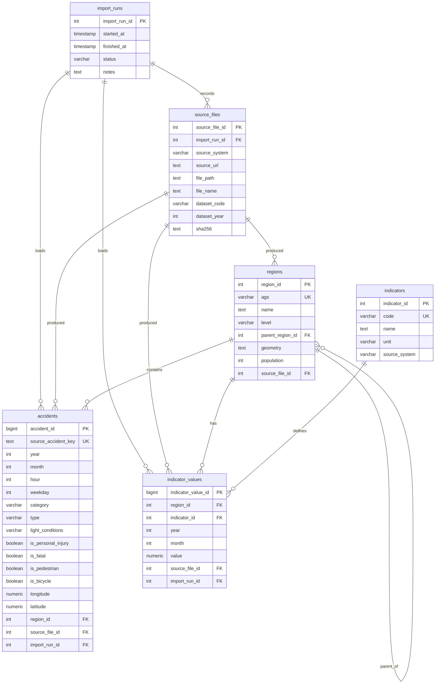

# Database Schema and Relationships

## Design Goal

The database stores a canonical model, not one table per raw file.

Main separation:

- `regions`: official administrative geography.
- `accidents`: event-level Unfallatlas records.
- `indicators`: statistical measure definitions.
- `indicator_values`: yearly/monthly statistical values.
- `import_runs` and `source_files`: provenance and reproducibility.

## Entity Relationship Diagram

## Primary Keys

| Table | Primary key |
| --- | --- |
| `import_runs` | `import_run_id` |
| `source_files` | `source_file_id` |
| `regions` | `region_id` |
| `accidents` | `accident_id` |
| `indicators` | `indicator_id` |
| `indicator_values` | `indicator_value_id` |

## Important Unique Keys

| Table | Unique key | Purpose |
| --- | --- | --- |
| `regions` | `ags` | official regional join key |
| `accidents` | `source_accident_key` | duplicate prevention |
| `indicators` | `code` | stable ETL/query indicator reference |
| `indicator_values` | `(region_id, indicator_id, year, month)` | one value per measure/region/time |

## Foreign Keys

| From | To | Meaning |
| --- | --- | --- |
| `regions.parent_region_id` | `regions.region_id` | hierarchy |
| `accidents.region_id` | `regions.region_id` | accident location |
| `indicator_values.region_id` | `regions.region_id` | statistical value location |
| `indicator_values.indicator_id` | `indicators.indicator_id` | value definition |
| `accidents.source_file_id` | `source_files.source_file_id` | provenance |
| `indicator_values.import_run_id` | `import_runs.import_run_id` | ETL run provenance |

## Why This Is Normalized

Raw source files have different schemas and different levels of aggregation. The database resolves that by using:

- one region dimension for all sources.
- one accident fact table for event data.
- one indicator definition/value pair for all statistical measures.
- separate provenance tables.

This supports analytics without depending on raw files at runtime.
