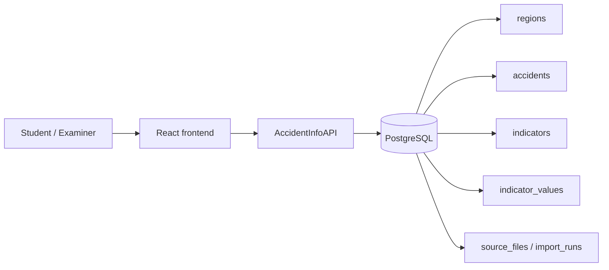
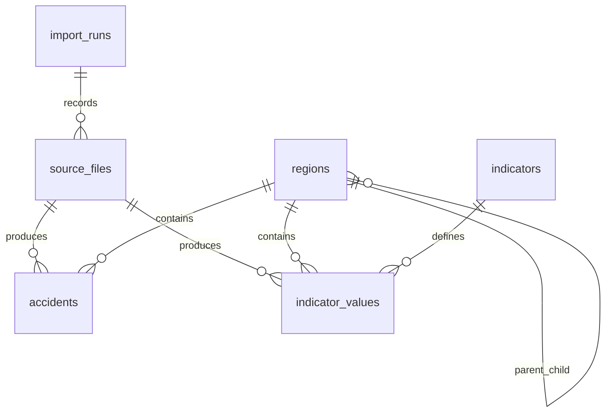

# AccidentInfoAPI

AccidentInfoAPI is the backend contract for the project. The frontend never reads the database directly.

## Base URL

`/accidentinfoapi`

## Main idea

- `regions` answers hierarchy and AGS lookups
- `accidents` answers event-level traffic accident questions
- `indicators` and `indicator_values` answer Regionalatlas-based statistics
- `import_runs` and `source_files` explain reproducibility

## Use case diagram

## Relational view

## Important endpoints

- `GET /accidentinfoapi/health`
- `GET /accidentinfoapi/openapi.json`
- `GET /accidentinfoapi/question-catalog`
- `GET /accidentinfoapi/metadata/coverage`
- `GET /accidentinfoapi/regions`
- `GET /accidentinfoapi/regions/:ags`
- `GET /accidentinfoapi/answers/earliest-accident-year`
- `GET /accidentinfoapi/answers/count`
- `GET /accidentinfoapi/answers/available-from`
- `GET /accidentinfoapi/answers/passenger-car-rate`
- `GET /accidentinfoapi/answers/top-fatal-districts`
- `GET /accidentinfoapi/answers/bicycle-dresden`
- `GET /accidentinfoapi/answers/zero-accident-municipalities`
- `GET /accidentinfoapi/schema-map`

## Beginner mapping

| Question type | Main table(s) |
| --- | --- |
| Earliest accident year | `accidents` |
| Saxony / Berlin / NRW counts | `accidents`, `regions` |
| Availability by state | `accidents`, `regions` |
| Passenger-car rate | `accidents`, `regions`, `indicators`, `indicator_values` |
| Top fatal districts | `accidents`, `regions` |
| Bicycle accidents in Dresden | `accidents`, `regions` |
| Zero-accident municipalities | `regions`, `accidents` |

## Dynamic frontend contract

The frontend reads `GET /accidentinfoapi/question-catalog` before rendering forms.

Each question definition contains:

- `id`
- `title`
- `description`
- `endpoint`
- `fields`
- `answerShape`

This keeps the frontend simple. If a question definition changes in the backend, the form changes automatically.

## Schema keys

- `regions.region_id` primary key
- `regions.ags` official join key
- `accidents.source_accident_key` unique accident key
- `indicators.code` unique indicator key
- `indicator_values.(region_id, indicator_id, year, month)` unique value key

## Source period note

Some official Regionalatlas tables use different reporting dates in the same download:

- traffic accidents: `2023`
- passenger cars: `01.01.2025`
- population/area: `31.12.2024`

So the API exposes the year used for both the numerator and denominator when a cross-source result is returned.
