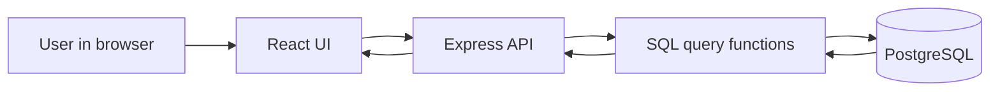

# Beginner Guide: How AccidentInfoAPI Works

This guide explains the project in simple terms.

## 1. What this project does

The project answers traffic-accident questions for Germany.

It combines:

- Unfallatlas accident data
- GV-ISys region data
- Regionalatlas statistical data

The important idea is:

- raw files are downloaded first
- data is cleaned and normalized
- normalized data is stored in PostgreSQL
- the frontend asks the backend API
- the frontend does not read the database directly

## 2. The backend layers

The backend has 4 main parts:

- `server.js` starts the Express server
- `src/etl/` downloads, parses, transforms, and loads data
- `src/db/` connects to PostgreSQL
- `src/api/` answers questions with JSON

## 3. Request flow



## 4. How the API is created

The API is built with Express.

### Step 1: Start the server

`backend/server.js` creates the app, adds CORS, logs requests, and exposes routes.

### Step 2: Mount the API router

`/accidentinfoapi` is connected to `src/api/routes.js`.

That file defines routes like:

- `/health`
- `/question-catalog`
- `/metadata/coverage`
- `/regions`
- `/answers/earliest-accident-year`
- `/answers/count`
- `/answers/passenger-car-rate`

### Step 3: Call SQL helper functions

Each route calls a function from `src/api/queries.js`.

Those functions do things like:

- `MIN(year)`
- `COUNT(*)`
- `GROUP BY`
- `JOIN regions`
- `LEFT JOIN` for zero-case analysis

### Step 4: Return JSON

The API sends back JSON so the frontend can show it.

Example:

```json
{
  "status": "success",
  "data": 2016
}
```

## 5. How the ETL works

ETL means:

- Extract
- Transform
- Load

### Extract

The downloader gets the source files from the official portals.

The current download files are:

- `src/etl/extractors/downloadhelper.js`: starts the reproducible download process.
- `src/etl/extractors/downloader.js`: shared helper for download, cache, checksum, ZIP extraction, metadata, and manifest files.

### Parse

The parser reads:

- CSV
- Excel
- text files

### Transform

The transformer converts different source formats into one clean model.

Examples:

- region names become `regions`
- accident rows become `accidents`
- statistics become `indicators` and `indicator_values`

### Load

The loader inserts the normalized rows into PostgreSQL.

### Aggregate

The aggregator builds totals and rates for analytics.

### Provenance

The database also stores where the data came from and which import run created it.

### Documentation note

The files in `backend/docs` are manually written explanation files. They are not generated automatically by the ETL.

The generated reproducibility outputs are:

- download manifest JSON files;
- source metadata JSON files;
- `source_files` database rows;
- `import_runs` database rows.

## 6. Main tables and what they mean

### `regions`

Stores official geography:

- state
- district
- municipality

Key fields:

- `region_id`
- `ags`
- `name`
- `level`
- `parent_region_id`

### `accidents`

Stores Unfallatlas accident events.

Key fields:

- `accident_id`
- `year`
- `month`
- `hour`
- `weekday`
- `category`
- `type`
- `light_conditions`
- `participants`
- `longitude`
- `latitude`
- `region_id`

### `indicators`

Stores indicator definitions like:

- passenger cars
- population
- area

### `indicator_values`

Stores the yearly or monthly values for each indicator and region.

## 7. How the frontend works

The frontend is built with React.

React is useful because it updates only the parts of the page that change.

### Core idea

- state lives in components
- components render the UI
- when state changes, React re-renders the screen

### In this project

- `App.jsx` loads backend metadata
- `QuestionConsole.jsx` builds the form from backend question definitions
- `SchemaExplorer.jsx` shows the schema explanation
- `DocsPanel.jsx` shows API docs and licence notes

### Why this is beginner-friendly

The frontend does not hardcode answers.

It only:

- fetches data from the API
- shows a form
- sends query parameters
- prints the returned JSON

## 8. How an answer is produced

Example question:

> How many accidents involving personal injury occurred in Saxony in 2023?

The backend does this:

1. find Saxony in `regions`
2. filter `accidents` by `year = 2023`
3. filter `accidents.is_personal_injury = true`
4. count the rows
5. return the number as JSON

So the answer comes from the database, not from hardcoded text.

## 9. How to check if answers are correct

Use the API and compare it with the source tables.

Good checks:

- `GET /accidentinfoapi/answers/earliest-accident-year`
- `GET /accidentinfoapi/answers/count?year=2023&stateAgs=14&personalInjury=true`
- `GET /accidentinfoapi/answers/passenger-car-rate?year=2023`

For cross-source questions, the answer should include the year used for both datasets.

## 10. Important design rule

The frontend must never read PostgreSQL directly.

It only talks to the API.

That keeps the system:

- cleaner
- safer
- easier to explain
- easier to test

## 11. Short summary

- ETL prepares the data
- PostgreSQL stores the normalized tables
- Express API answers the questions
- React shows the answers
- all results are dynamic and come from the database
