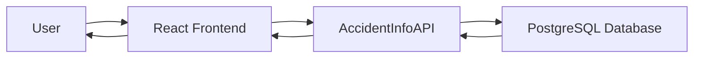
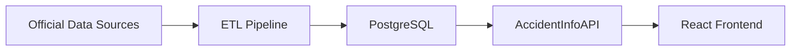
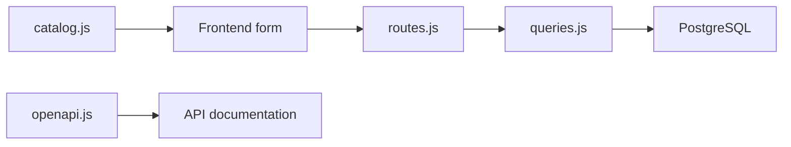

# AccidentInfoAPI Report

**Project:** German Traffic Accident Data Integration and Analytics  
**API name:** AccidentInfoAPI  
**Backend technology:** Node.js, Express, PostgreSQL  
**Frontend technology:** React and Bootstrap  

This report explains the API part of the project in simple English. The goal is to show how the frontend asks questions, how the backend API processes those questions, and how answers are calculated from the normalized database.

---

## Page 1: API Overview

### 1.1 Purpose of the API

AccidentInfoAPI is the backend interface for the traffic accident analytics system.

The frontend does not access PostgreSQL directly. Instead, the frontend sends HTTP requests to AccidentInfoAPI. The API then reads the normalized database tables and returns the answer as JSON.

This makes the system cleaner and safer because all database access is controlled by the backend.

### 1.2 Main Responsibility

The API is responsible for:

- returning available questions to the frontend;
- returning dropdown options such as years, states, and regions;
- answering accident count questions;
- answering regional comparison questions;
- answering cross-source questions;
- explaining which database tables are used.

### 1.3 System Flow



### 1.4 Important Design Rule

The frontend never reads the database directly.

```text
Correct:
Frontend -> API -> PostgreSQL

Not allowed:
Frontend -> PostgreSQL
```

This is important for the assignment because it shows a proper backend API layer.

### 1.5 Relation Between ETL and API

The ETL and API are separate parts of the backend.

| Part | Job |
| --- | --- |
| ETL | Downloads, parses, transforms, and loads official source data |
| API | Reads the already-loaded database and answers questions |

The ETL writes data into PostgreSQL. The API reads data from PostgreSQL.



<div style="page-break-after: always;"></div>

---

## Page 2: API Components

The API code is divided into small files. Each file has one main responsibility.

### 2.1 `routes.js`

File:

```text
backend/src/api/routes.js
```

This file defines the API URLs.

Example:

```text
GET /accidentinfoapi/answers/count
```

The route receives the request, calls a query function, and sends JSON back to the frontend.

Simple explanation:

```text
routes.js = URL controller
```

### 2.2 `queries.js`

File:

```text
backend/src/api/queries.js
```

This file contains the SQL logic.

It calculates answers from database tables such as:

- `accidents`
- `regions`
- `indicators`
- `indicator_values`

Example:

```text
countAccidents()
```

This function counts accident rows using filters like year, state, region name, bicycle, pedestrian, fatal, or personal injury.

Simple explanation:

```text
queries.js = database answer logic
```

### 2.3 `catalog.js`

File:

```text
backend/src/api/catalog.js
```

This file tells the frontend which questions exist.

Each catalog item contains:

- question title;
- description;
- endpoint;
- fields shown in the frontend;
- fixed filters;
- answer shape.

Example:

```text
Personal injury accidents by state and year
```

This question uses:

```text
GET /accidentinfoapi/answers/count
```

and automatically adds:

```text
personalInjury=true
```

Simple explanation:

```text
catalog.js = question menu for the frontend
```

### 2.4 `openapi.js`

File:

```text
backend/src/api/openapi.js
```

This file creates API documentation in OpenAPI format.

OpenAPI describes:

- which endpoints exist;
- which parameters are accepted;
- what each endpoint is used for.

The OpenAPI JSON is available at:

```text
GET /accidentinfoapi/openapi.json
```

Simple explanation:

```text
openapi.js = machine-readable API documentation
```

### 2.5 Component Flow



<div style="page-break-after: always;"></div>

---

## Page 3: Endpoint Documentation

The base path for the API is:

```text
/accidentinfoapi
```

### 3.1 Metadata and Region Endpoints

| Endpoint | Purpose | Main tables |
| --- | --- | --- |
| `GET /health` | Checks if the API is running | none |
| `GET /openapi.json` | Returns OpenAPI documentation | none |
| `GET /question-catalog` | Returns frontend question definitions | none |
| `GET /metadata/coverage` | Shows dataset coverage | `accidents`, `regions`, `indicators`, `source_files` |
| `GET /metadata/options` | Returns dropdown options | `accidents`, `regions` |
| `GET /regions` | Lists regions | `regions` |
| `GET /regions/:ags` | Finds one region by AGS | `regions` |
| `GET /schema-map` | Explains table usage | none |

### 3.2 Answer Endpoints

| Endpoint | Purpose | Main tables |
| --- | --- | --- |
| `GET /answers/earliest-accident-year` | Finds earliest accident year | `accidents` |
| `GET /answers/count` | Counts accidents with filters | `accidents`, `regions` |
| `GET /answers/available-from` | Finds first available year for a state | `accidents`, `regions` |
| `GET /answers/passenger-car-rate` | Calculates accident rate per 100,000 passenger cars | `accidents`, `regions`, `indicators`, `indicator_values` |
| `GET /answers/top-fatal-districts` | Ranks districts by fatal accidents | `accidents`, `regions` |
| `GET /answers/zero-accident-municipalities` | Finds municipalities with zero accidents | `regions`, `accidents` |

### 3.3 Example: Count Endpoint

Endpoint:

```text
GET /accidentinfoapi/answers/count
```

Purpose:

```text
Counts accident records using selected filters.
```

Common parameters:

| Parameter | Meaning | Example |
| --- | --- | --- |
| `year` | accident year | `2024` |
| `stateAgs` | federal state AGS | `14` |
| `regionName` | region name text | `Dresden` |
| `personalInjury` | only personal injury accidents | `true` |
| `pedestrian` | only pedestrian accidents | `true` |
| `bicycle` | only bicycle accidents | `true` |
| `fatal` | only fatal accidents | `true` |

Example request:

```text
GET /accidentinfoapi/answers/count?year=2024&regionName=Dresden&bicycle=true
```

This answers:

```text
How many bicycle accidents occurred in Dresden in 2024?
```

### 3.4 Example Response

```json
{
  "api": "accidentinfoapi",
  "question": "Count accidents with filters.",
  "data": {
    "answer": 1225,
    "filters": {
      "year": 2024,
      "regionName": "Dresden",
      "bicycle": true
    }
  }
}
```

The value is not hardcoded. It is calculated from the `accidents` table joined with the `regions` table.

<div style="page-break-after: always;"></div>

---

## Page 4: Required Question Mapping

This section shows how the required assignment questions are answered.

### 4.1 Required Questions

| Required question | Endpoint | Filters | Tables used |
| --- | --- | --- | --- |
| Earliest accident year | `/answers/earliest-accident-year` | none | `accidents` |
| Personal injury accidents in Saxony in 2023 | `/answers/count` | `year=2023`, `stateAgs=14`, `personalInjury=true` | `accidents`, `regions` |
| Data available from year for North Rhine-Westphalia | `/answers/available-from` | `stateAgs=05` | `accidents`, `regions` |
| Data available from year for Mecklenburg-Western Pomerania | `/answers/available-from` | `stateAgs=13` | `accidents`, `regions` |
| Pedestrian accidents in Berlin in 2023 | `/answers/count` | `year=2023`, `stateAgs=11`, `pedestrian=true` | `accidents`, `regions` |
| Accidents per 100,000 passenger cars | `/answers/passenger-car-rate` | `year=2023`, `limit=5` | `accidents`, `regions`, `indicators`, `indicator_values` |

### 4.2 Optional Questions

| Optional question | Endpoint | Filters | Tables used |
| --- | --- | --- | --- |
| Top 5 fatal districts in 2024 | `/answers/top-fatal-districts` | `year=2024`, `limit=5` | `accidents`, `regions` |
| Bicycle accidents in Dresden in 2024 | `/answers/count` | `year=2024`, `regionName=Dresden`, `bicycle=true` | `accidents`, `regions` |
| Municipalities in Saxony with zero accidents in 2023 | `/answers/zero-accident-municipalities` | `stateAgs=14`, `year=2023` | `regions`, `accidents` |

### 4.3 Why `regions` Is Needed

The `accidents` table stores the accident event and the `region_id`.

The `regions` table stores:

- AGS code;
- state;
- district;
- municipality;
- parent-child region hierarchy.

When the user selects Saxony, Berlin, or Dresden, the API uses `regions` to connect the human region filter to accident rows.

### 4.4 Why the Cross-Source Query Uses More Tables

The passenger-car rate question needs at least two sources:

| Data | Source | Table |
| --- | --- | --- |
| Accident count | Unfallatlas | `accidents` |
| Passenger car stock | Regionalatlas | `indicator_values` |
| Indicator definition | Regionalatlas metadata | `indicators` |
| Region join | GV-ISys | `regions` |

Formula:

```text
accidents per 100,000 passenger cars =
(accident_count / passenger_cars) * 100000
```

This proves that the API can answer a question using more than one dataset.

### 4.5 Why Answers Are Not Hardcoded

The API calculates answers at request time.

For example, this request:

```text
GET /accidentinfoapi/answers/count?year=2024&regionName=Dresden&bicycle=true
```

causes the backend to run a SQL query similar to:

```sql
SELECT COUNT(*) AS answer
FROM accidents a
JOIN regions r ON r.region_id = a.region_id
LEFT JOIN regions parent ON parent.region_id = r.parent_region_id
WHERE a.year = 2024
  AND a.is_bicycle = TRUE
  AND (r.name ILIKE '%Dresden%' OR parent.name ILIKE '%Dresden%');
```

The result comes from the normalized database, not from fixed text in the frontend.

<div style="page-break-after: always;"></div>

---

## Page 5: Validation, Errors, and Summary

### 5.1 Error Handling

The API returns meaningful HTTP responses.

| Status | Meaning | Example |
| --- | --- | --- |
| `200` | request succeeded | answer returned |
| `400` | invalid filter | missing `stateAgs` or invalid year |
| `404` | region not found | unknown AGS in `/regions/:ags` |
| `500` | server error | unexpected backend problem |

Example:

```text
GET /accidentinfoapi/answers/available-from
```

This request is missing `stateAgs`, so the API returns:

```json
{
  "error": "invalid_filter",
  "message": "stateAgs is required."
}
```

### 5.2 Data Provenance

The API reads from normalized database tables. The database was created by the ETL pipeline.

Provenance is stored in:

- `import_runs`
- `source_files`

These tables explain:

- when the ETL ran;
- which source files were used;
- where source files came from;
- which import run produced the data.

### 5.3 Data Licence Note

The frontend displays this licence note:

```text
Official public data from Unfallatlas, GV-ISys / Destatis, and Regionalatlas.
Reuse and licence terms follow the original providers.
```

The project does not claim ownership of the official data. It integrates and analyzes the public datasets.

### 5.4 How to Test the API

Start the backend:

```bash
npm run dev
```

Then test examples:

```bash
curl "http://localhost:3000/accidentinfoapi/health"
curl "http://localhost:3000/accidentinfoapi/answers/earliest-accident-year"
curl "http://localhost:3000/accidentinfoapi/answers/count?year=2023&stateAgs=14&personalInjury=true"
curl "http://localhost:3000/accidentinfoapi/answers/count?year=2024&regionName=Dresden&bicycle=true"
```

### 5.5 Short Presentation Explanation

AccidentInfoAPI is the backend API for the traffic accident analytics system. The frontend sends requests to the API instead of reading PostgreSQL directly. The API validates input filters, runs SQL queries on normalized tables, and returns JSON answers. The ETL pipeline builds the database, while the API only reads from it. This separation makes the system reproducible, easier to test, and easier to explain.

### 5.6 Final Summary

| Requirement | How the API supports it |
| --- | --- |
| No direct frontend database access | Frontend uses AccidentInfoAPI |
| Normalized database model | API reads `regions`, `accidents`, `indicators`, and `indicator_values` |
| Required analytical questions | Answered through `/answers/*` endpoints |
| Cross-source query | Passenger-car rate combines Unfallatlas and Regionalatlas |
| Zero-case analysis | Uses `regions` left joined with `accidents` |
| Documentation | OpenAPI JSON and this report |
| Reproducibility | ETL provenance stored in `import_runs` and `source_files` |

