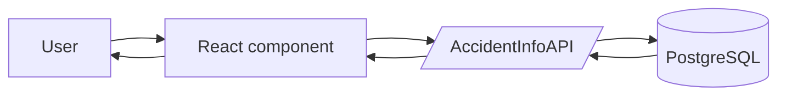

# AccidentInfoAPI Frontend

This is a React + Bootstrap client for `AccidentInfoAPI`.

The frontend does not read the database. It only talks to the backend API.

## What React does here

React builds the page from small components:

- `App.jsx` loads backend metadata and switches between tabs.
- `QuestionConsole.jsx` shows a question form and sends API requests.
- `SchemaExplorer.jsx` explains which tables answer which questions.

## How the app works



## Beginner flow

1. The page opens in the browser.
2. `App.jsx` asks the backend for the question catalog and region list.
3. The home page shows source and licence notes.
4. `QuestionConsole.jsx` renders a simple form from that catalog.
5. The user fills in a year, state, or region.
6. React sends a `GET` request to the API.
7. The API returns JSON.
8. React shows the answer in a readable format, with raw JSON available only when needed.

## Main files

- [`src/App.jsx`](./src/App.jsx)
- [`src/api.js`](./src/api.js)
- [`src/components/QuestionConsole.jsx`](./src/components/QuestionConsole.jsx)
- [`src/components/SchemaExplorer.jsx`](./src/components/SchemaExplorer.jsx)

## Data licences

The app only presents data from official public sources. The source licences and reuse terms stay with the original providers:

- Unfallatlas / OpenGeodata NRW
- Regionalatlas / Statistikportal
- GV-ISys / Destatis

## Run locally

```bash
npm install
npm run dev
```

By default the frontend expects the backend at `http://localhost:3000`.
